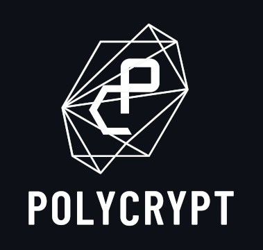

<h1 align="center"><br>
    <a href="https://polycry.pt/"></a>
<br></h1>

<h4 align="center">PolyCrypt's go utils</h4>

<p align="center">
  <a href="https://goreportcard.com/report/github.com/perun-network/poly-go"></a>
  <a href="https://github.com/perun-network/poly-go/actions/workflows/ci.yml"></a>
  <a href="https://pkg.go.dev/polycry.pt/poly-go?status.svg"> </a>
  <a href="https://www.apache.org/licenses/LICENSE-2.0.txt"></a>
</p>

_poly-go_ provides generic helper functionality for golang projects. It is most prominently used by [PolyCrypt] in [go-perun] and [Erdstall]. 
Besides that everyone is free to use it in their projects as well 🤗

## Getting Started

Running _poly-go_ requires a working [Go distribution](https://golang.org), see `go.mod` for the required version.

```sh
# Clone the repository into a directory of your choice
git clone https://github.com/perun-network/poly-go.git
# Or directly download it with go
# go get -d perun.network/poly-go
cd poly-go
# Run the unit tests
go test ./...
```

You can import _poly-go_ in your project like this:

```go
import "polycry.pt/poly-go/test"
```

### Documentation

More in-depth documentation can be found on [go doc].

## Funding

This project has been started at the Chair of Applied Cryptography at Technische Universität Darmstadt, Germany, and is currently developed and maintained by PolyCrypt GmbH.
We thank the German Federal Ministry of Education and Research (BMBF) for their funding through the StartUpSecure grants program as well as the German Science Foundation (DFG), the Foundation for Polish Science (FNP) and the Ethereum Foundation for their support of this implementation.

## Copyright

Copyright 2021 - See [NOTICE file](NOTICE) for copyright holders.
Use of the source code is governed by the Apache 2.0 license that can be found in the [LICENSE file](LICENSE).

Contact us at [info@polycry.pt](mailto:info@polycry.pt).

<!-- Links -->

[PolyCrypt]: https://polycry.pt
[go-perun]: https://github.com/hyperledger-labs/go-perun
[Erdstall]: https://erdstall.dev/
[go doc]: https://pkg.go.dev/polycry.pt/poly-go
